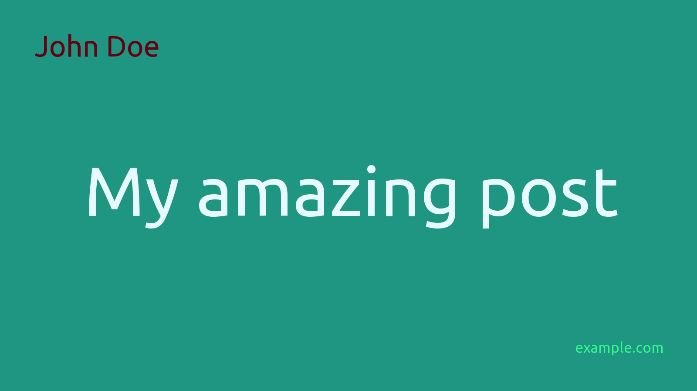

# Post Social Image


A simple command line tool to generate images suitable for sharing on social media sites.


## Installation

```
composer require crazko/post-social-images
```

## Usage

```php
<?php

use Crazko\PostSocialImage\Image;
use Crazko\PostSocialImage\Position;

$title = 'My amazing post';

$image = new Image(1600, '#1E9682', '/ubuntu.ttf', 80);
$image->text($title, 120, '#E6FAFF'); // First text is always wrapped and centered
$image->text('example.com', 25, '#33F88A', Position::BOTTOM | Position::RIGHT);

// More texts can be placed into image
$image->text('John Doe', 50, '#660012', Position::TOP | Position::LEFT);

$path = $image->save($title, './assests/img'); // ./assets/img/my-amazing-post.png
```



### API

#### `new Image(int $width, string $background, string $font, int $padding)`

Creates new `Image` instance.

- `$width` - width of the image in px, height is calculated proportionaly 16:9
- `$background` - HEX color of the image background, e.g.: `ff8800` or `#ff8800`
- `$fontPath` - path to the font used in the image
- `$padding` - free space around the image in px

#### `Image::text(string $text, int $size, string $color, ?int $position = null)`

Adds text to the image. Can be used multiple times. First one is always centered, wrapped when the text is too long and resized to always fit the image - considered as a main title.

- `$text` - given text
- `$size` - size of the text in px
- `$color` - HEX color of the text, e.g.: `ff8800` or `#ff8800`
- `$position` - position of the text in the image, use combination of `Position::TOP`, `Position::BOTTOM`, `Position::LEFT`, `Position::RIGHT`, e.g.: `Position::TOP | Position::RIGHT`

#### `Image::save(string $name, string $destination)`

Saves generated image to the `$destination` with given ([webalized](https://doc.nette.org/en/2.4/strings#toc-webalize)) `$name` and returns resulting path.

#### `Image::get()`

Returns generated image.

### CLI

```
vendor/bin/create-image -o example.com ./assets/img "My amazing post"
```

Resulting success message:

> Image was created in ./assets/img/my-amazing-post.png

#### Composer command

You can also [define a new command](https://getcomposer.org/doc/articles/scripts.md#writing-custom-commands) in your `composer.json` to avoid constantly typing every option:

```json
{
    "scripts": {
        "image": "vendor/bin/create-image --ansi -b E6FAFF -f 1E9682 -c E1738A -o example.com ./assets/img"
    },
}
```

and use it to create new images more easily:

```
composer image "My amazing post"
```

#### Available options

Type `vendor/bin/create-image --help` to see all available options.

```
Description:
  Creates a new social image.

Usage:
  create [options] [--] <destination> <title>

Arguments:
  destination                            Where to save the image?
  title                                  Title of the post the image should be generated for.

Options:
  -w, --width=WIDTH                      The width of the image in px. Height is calculated proportionaly 16:9. [default: 1200]
  -p, --padding=PADDING                  The padding of the image in px. [default: 50]
  -s, --size=SIZE                        The size of the image title in px. [default: 100]
  -b, --colorBackground=COLORBACKGROUND  HEX color of the title. [default: "ffffff"]
  -f, --colorForeground=COLORFOREGROUND  HEX color of the image background. [default: "000000"]
  -o, --origin=ORIGIN                    E.g. your name or the name of your blog.
  -c, --colorOrigin=COLORORIGIN          HEX color of the origin. [default: "000000"]
  -h, --help                             Display this help message
  -q, --quiet                            Do not output any message
  -V, --version                          Display this application version
      --ansi                             Force ANSI output
      --no-ansi                          Disable ANSI output
  -n, --no-interaction                   Do not ask any interactive question
  -v|vv|vvv, --verbose                   Increase the verbosity of messages: 1 for normal output, 2 for more verbose output and 3 for debug

Help:
  Creates a new social image with a defined title and optional signature.
```

## How to add image to the site

Add following meta tags to the `<head>` element of your page:

```html
<meta name="twitter:image" content="/assets/img/my-amazing-post.png">
<meta property="og:image" content="/assets/img/my-amazing-post.png">
```

All recommended tags:

```html
<meta name="twitter:card" content="summary_large_image">
<meta name="twitter:creator" content="@twitter_handle">
<meta name="twitter:title" content="My amazing post">
<meta name="twitter:description" content="My amazing post introduction for visitors and crawlers.">
<meta name="twitter:image" content="/assets/img/my-amazing-post.png">

<meta property="og:type" content="article">
<meta property="og:title" content="My amazing post">
<meta property="og:description" content="My amazing post introduction for visitors and crawlers.">
<meta property="og:url" content="https://example.com/my-amazing-post">
<meta property="og:image" content="/assets/img/my-amazing-post.png">
```

See [The Open Graph protocol](http://ogp.me/) and [Twitter Cards](https://developer.twitter.com/en/docs/tweets/optimize-with-cards/overview/abouts-cards) for more info about other meta tags.

### Preview

Try to add your page to the https://metatags.io/ to see how would it look like with your amazing new social image when shared on Facebook, Twitter, Linkedin and others.
